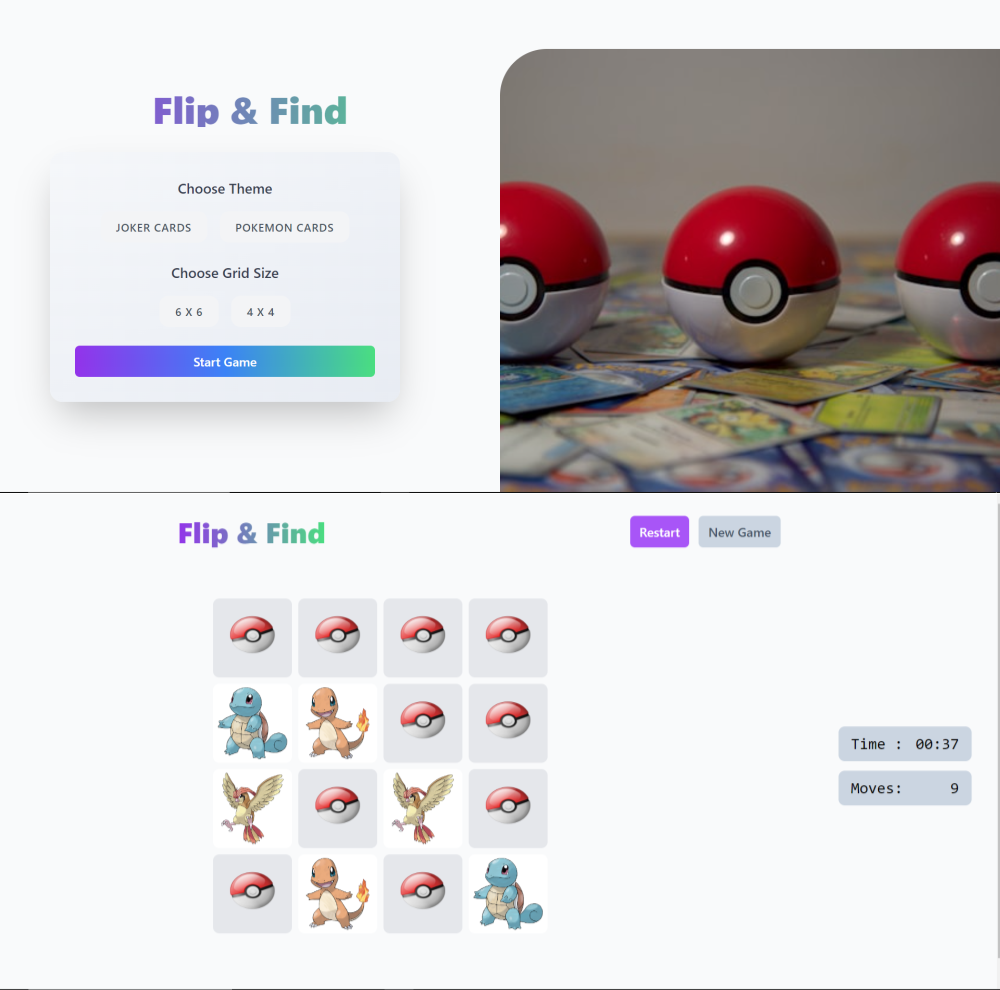

# Flip & Find

### Modern React Game for Fun and Memory Training

---

## Table of Contents

- [Overview](#overview)
- [Features](#features)
- [Technologies](#technologies)
- [Deployment](#deployment)
- [Author](#author)

---

## Overview

Flip & Find is an interactive React game designed to challenge your memory and provide entertainment. Users can select their preferred theme (Joker Cards or Pokemon Cards) and grid size (4x4 or 6x6). Flip cards to find matching pairs while racing against the clock. Celebrate your victory with a burst of colorful animated particles if you finish in under 60 seconds!

---

## 

---

## Features

- **Theme Selection**: Choose between Joker Cards and Pokemon Cards to customize the game.
- **Grid Options**: Select grid sizes of 4x4 or 6x6 for varied difficulty levels.
- **Card Flipping**:
  - Flip the cards to reveal their hidden sides.
  - Find matching pairs to score!
- **Timer**: The timer starts as soon as the game begins, challenging you to finish quickly.
- **Move Counter**: Tracks every 2 cards flipped as a move.
- **Win Celebration**:
  - Celebrate victories with confetti if you complete the game in less than 60 seconds.
  - **Win Modal**: A modal is displayed upon winning, showing:
    - Time elapsed.
    - Total move count.
    - A personalized message based on performance (e.g., "Great Job!" or "You're a Memory Master!").
- **Game Controls**:
  - **Restart Game**: Reset the current game and try again.
  - **New Game**: Choose new game options and start fresh.
- **Notifications**: Provides instant feedback with Toastify notifications.
- **Confirmation Alerts**: Uses React Confirm Alert for secure game resets or exits.
- **Responsive Design**: Fully responsive across all devices, providing an optimized experience on mobile, tablet, and desktop.

---

## Technologies

- **React** (with Hooks: `useState`, `useEffect`, `useCallback`, `useContext`, `useRef`)
- **React Context API** for state management
- **Tailwind CSS** for modern, responsive styling
- **Toastify** for user notifications
- **React-Confirm-Alert** for confirmation dialogs
- **React-Confetti** for victory celebrations
- **CSS** for custom styling
- **JavaScript** for game logic
- **Vite** for fast builds and development

---

## Deployment

# [Flip & Find Application](https://flip-find-salahaz.netlify.app/)

---

## Author

- Salah Eddine Ait Zenni
- GitHub: [salaheddineaz47](https://github.com/salaheddineaz47)

---

Feel free to reach out if you have any questions or suggestions!
